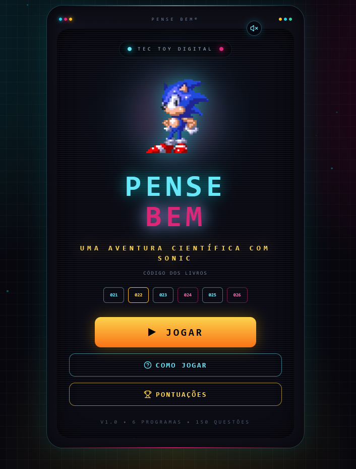
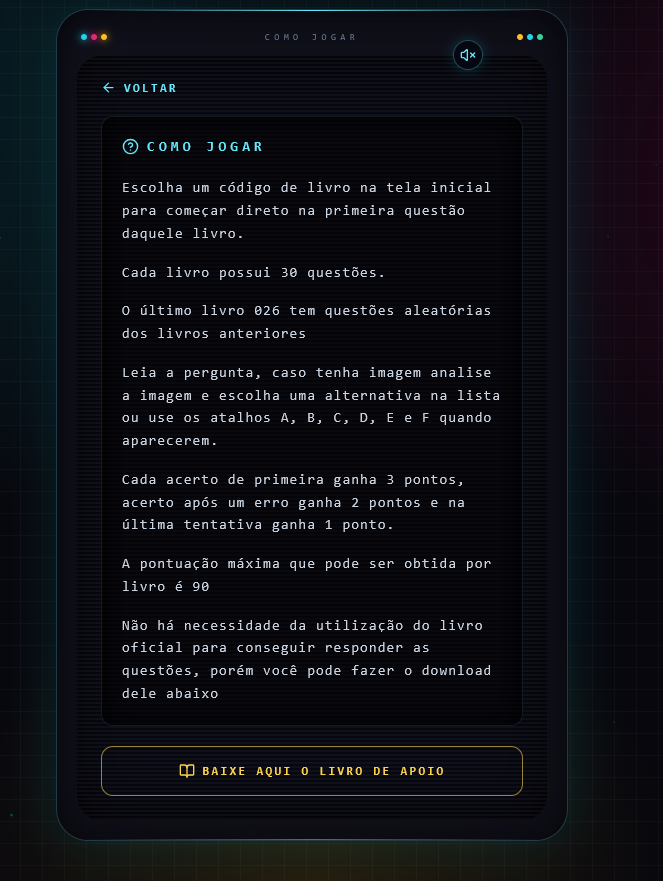
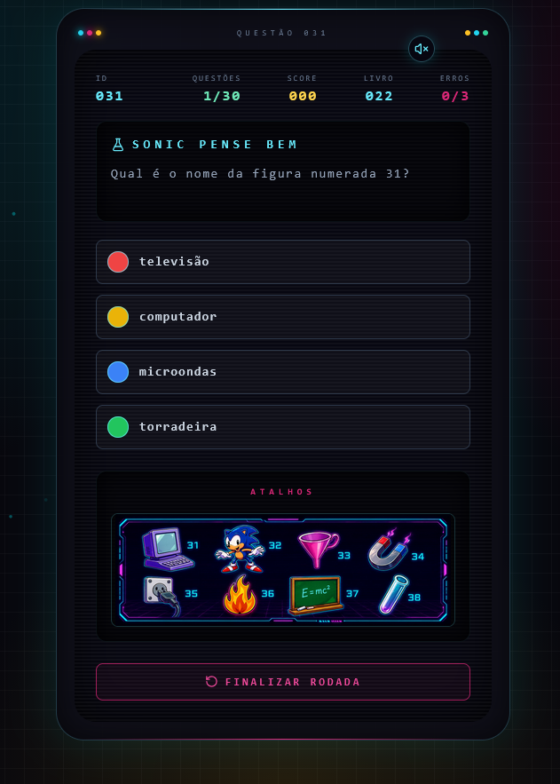
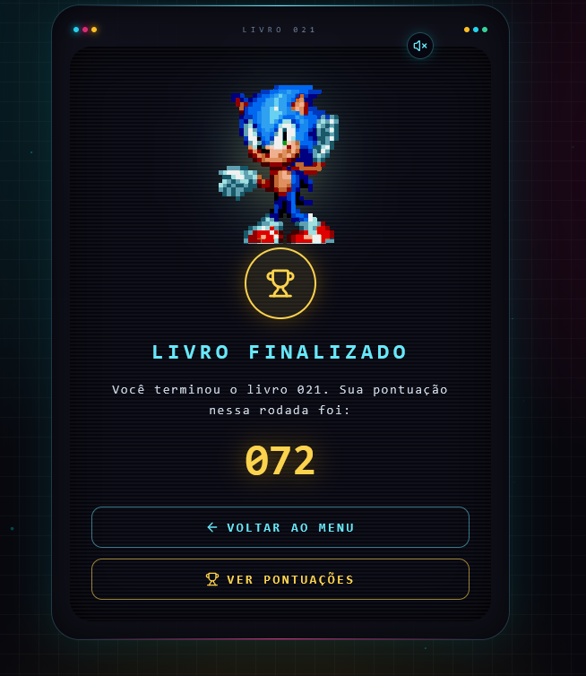
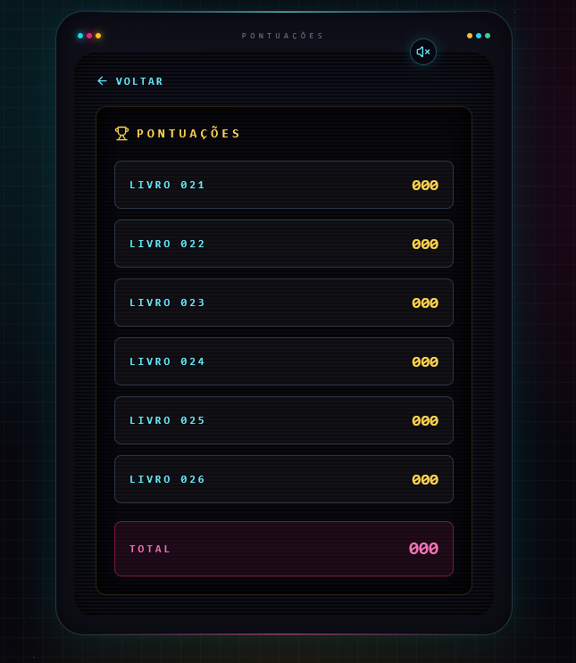

# Pense Bem Sonic

Uma releitura web do clássico **Pense Bem**, com perguntas inspiradas no universo Sonic e em desafios de raciocínio. O jogo roda direto no navegador, sem precisar do aparelho original, do livro físico ou de assinatura do GPT.



## Destaques

- Quiz dividido por códigos de livros.
- 30 perguntas por livro, com pontuação por tentativa.
- Livro especial `026` com perguntas aleatórias dos livros anteriores.
- Imagens de apoio em algumas questões.
- Pontuações salvas localmente no navegador.
- Música, efeitos sonoros e animações temáticas.
- Easter Egg com personagem secreto ao interagir com todos os códigos de livro.
- Interface responsiva construída com React, Vite e Tailwind CSS.

## Telas

<p align="center">
  
  <br />
  <em>Tela inicial com seleção dos livros.</em>
</p>

<p align="center">
  
  <br />
  <em>Instruções resumidas de como jogar.</em>
</p>

<p align="center">
  
  <br />
  <em>Questões com alternativas e imagens de apoio.</em>
</p>

<p align="center">
  
  <br />
  <em>Resultado ao finalizar um livro.</em>
</p>

<p align="center">
  
  <br />
  <em>Histórico de melhores pontuações.</em>
</p>

## Personagens

<p align="center">
  
  &nbsp;&nbsp;&nbsp;
  
  &nbsp;&nbsp;&nbsp;
  
</p>

## Regras do Quiz

- Cada pergunta permite até 3 tentativas.
- Acerto na 1ª tentativa vale 3 pontos.
- Acerto na 2ª tentativa vale 2 pontos.
- Acerto na 3ª tentativa vale 1 ponto.
- Após 3 erros, o jogo avança sem pontuar.
- A pontuação máxima por livro é 90 pontos.

## Easter Egg

Clique pelo menos uma vez em cada código de livro na tela inicial. Ao completar todos, um personagem secreto é desbloqueado na interface.

## Arquitetura

A lógica principal do quiz fica centralizada na camada de domínio, em `src/domain`. Essa separação mantém as regras do jogo independentes da interface, facilita testes automatizados e deixa a evolução do projeto mais simples.

## Tecnologias

- React
- Vite
- Tailwind CSS
- Framer Motion
- Lucide React
- Jest
- Docker
- Nginx

## Como Rodar

Instale as dependências:

```bash
npm install
```

Inicie o ambiente de desenvolvimento:

```bash
npm run dev
```

Acesse:

```text
http://localhost:5173
```

## Scripts Úteis

```bash
npm run lint      # verifica padrões de código
npm test          # executa os testes
npm run build     # gera a build de produção
npm run preview   # pré-visualiza a build
```

## Docker

Crie a imagem:

```bash
docker build --no-cache -t pense-bem:test .
```

Suba o container:

```bash
docker run -d --rm --name pense-bem-test -p 8080:80 pense-bem:test
```

Acesse:

```text
http://localhost:8080
```

Pare o container:

```bash
docker stop pense-bem-test
```

## Estrutura

```text
src/
  components/       Telas e componentes visuais
  constants/        Constantes compartilhadas
  data/             Perguntas usadas pela interface
  domain/           Entidades e regras centrais do quiz
  hooks/            Estado, áudio e fluxo do jogo
  services/         Pontuação, livros e armazenamento
  utils/            Funções utilitárias
tests/              Testes automatizados
```
